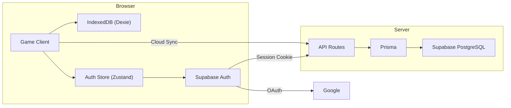
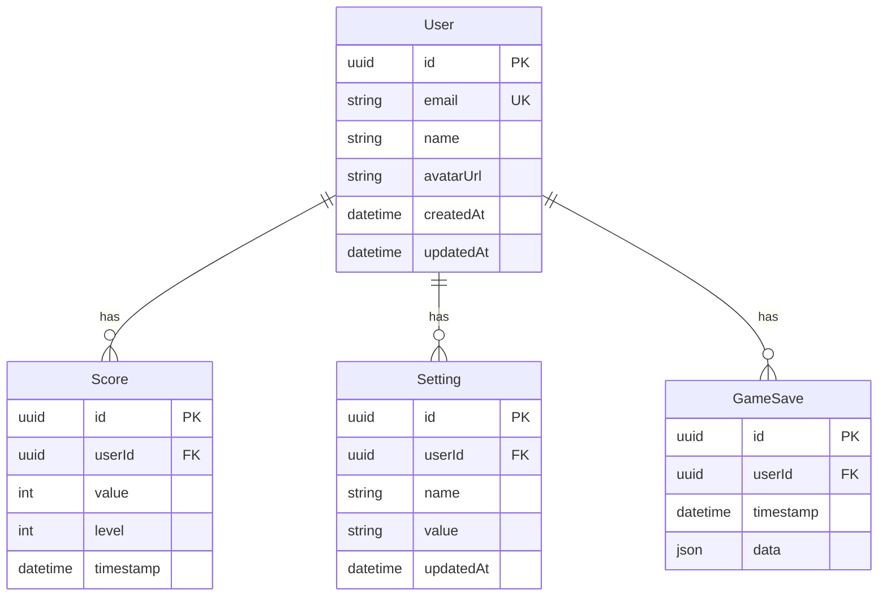
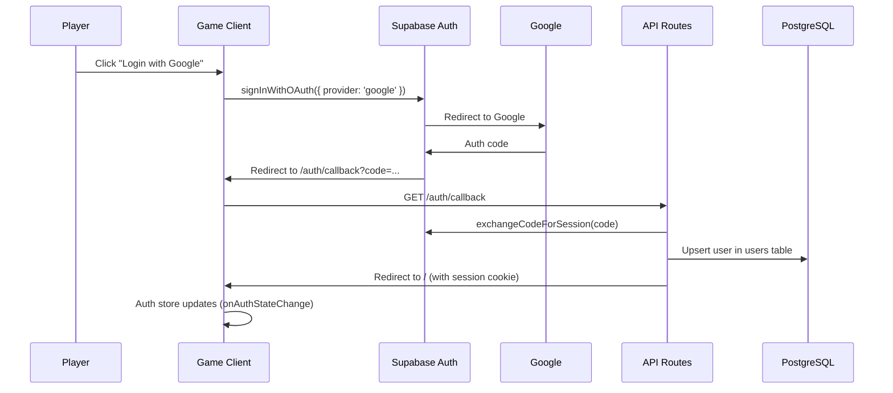
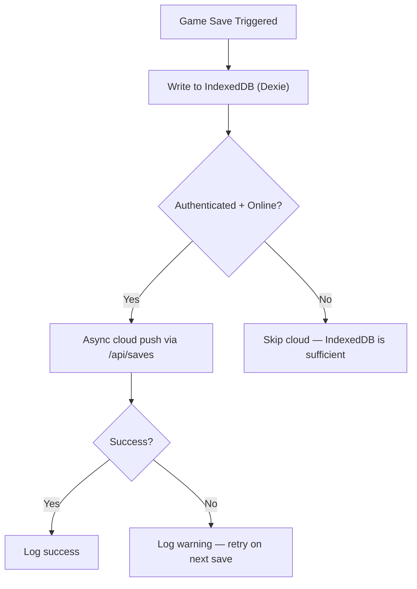
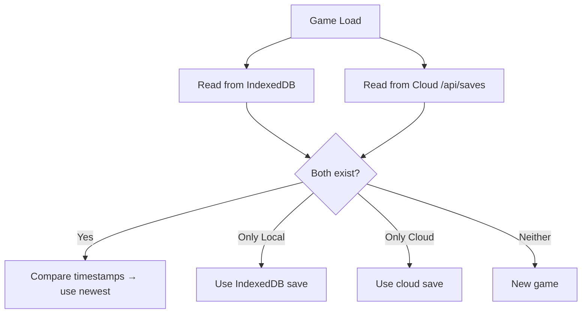
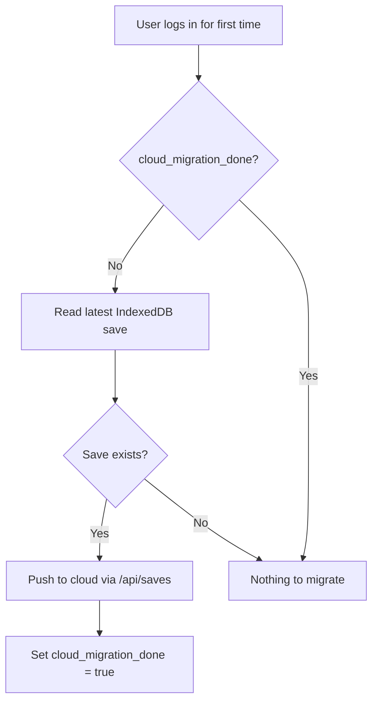

# Final Stage — Supabase + Prisma Integration Plan

> Full online persistence with offline-first IndexedDB + cloud sync.

---

## Architecture Overview



**Offline-first strategy:** IndexedDB is always the primary store. Cloud sync is non-blocking and gracefully degrades when offline or unauthenticated.

---

## Files Created / Modified

### New Files

| File | Purpose |
|------|---------|
| [.env.local](file:///Users/zekezander/Documents/GitHub/one-rpg-game-game/.env.local) | All env vars (Supabase, Google OAuth, DATABASE_URL) |
| [prisma/schema.prisma](file:///Users/zekezander/Documents/GitHub/one-rpg-game-game/prisma/schema.prisma) | Database schema: User, Score, Setting, GameSave |
| [prisma/rls-policies.sql](file:///Users/zekezander/Documents/GitHub/one-rpg-game-game/prisma/rls-policies.sql) | Row Level Security policies |
| [prisma.config.ts](file:///Users/zekezander/Documents/GitHub/one-rpg-game-game/prisma.config.ts) | Prisma config (loads .env + .env.local) |
| [lib/prisma.ts](file:///Users/zekezander/Documents/GitHub/one-rpg-game-game/lib/prisma.ts) | Prisma client singleton |
| [lib/supabase/client.ts](file:///Users/zekezander/Documents/GitHub/one-rpg-game-game/lib/supabase/client.ts) | Browser-side Supabase client |
| [lib/supabase/server.ts](file:///Users/zekezander/Documents/GitHub/one-rpg-game-game/lib/supabase/server.ts) | Server-side Supabase client + admin client |
| [lib/supabase/middleware.ts](file:///Users/zekezander/Documents/GitHub/one-rpg-game-game/lib/supabase/middleware.ts) | Session refresh middleware helper |
| [middleware.ts](file:///Users/zekezander/Documents/GitHub/one-rpg-game-game/middleware.ts) | Root Next.js middleware |
| [lib/store/authStore.ts](file:///Users/zekezander/Documents/GitHub/one-rpg-game-game/lib/store/authStore.ts) | Zustand auth store (Google OAuth, session) |
| [lib/db/cloudSync.ts](file:///Users/zekezander/Documents/GitHub/one-rpg-game-game/lib/db/cloudSync.ts) | Cloud sync service (save, load, migrate, resolve) |
| [app/auth/callback/route.ts](file:///Users/zekezander/Documents/GitHub/one-rpg-game-game/app/auth/callback/route.ts) | OAuth callback → session + Prisma user upsert |
| [app/api/saves/route.ts](file:///Users/zekezander/Documents/GitHub/one-rpg-game-game/app/api/saves/route.ts) | Cloud save GET/POST API |
| [app/api/settings/route.ts](file:///Users/zekezander/Documents/GitHub/one-rpg-game-game/app/api/settings/route.ts) | Settings GET/POST API |

### Modified Files

| File | Change |
|------|--------|
| [lib/store/index.ts](file:///Users/zekezander/Documents/GitHub/one-rpg-game-game/lib/store/index.ts) | Added `useAuthStore` export |
| [.gitignore](file:///Users/zekezander/Documents/GitHub/one-rpg-game-game/.gitignore) | Added `lib/generated/prisma/` |
| [package.json](file:///Users/zekezander/Documents/GitHub/one-rpg-game-game/package.json) | Added `@supabase/supabase-js`, `@supabase/ssr`, `prisma`, `dotenv` |

---

## Phase 1: Environment Setup ✅

### Environment Variables

```bash
# .env.local (git-ignored)
NEXT_PUBLIC_SUPABASE_URL=...          # Browser + Server
NEXT_PUBLIC_SUPABASE_ANON_KEY=...     # Browser + Server
SUPABASE_SERVICE_ROLE_KEY=...         # Server only
GOOGLE_CLIENT_ID=...                  # Server only
GOOGLE_CLIENT_SECRET=...              # Server only
DATABASE_URL="postgresql://..."       # Server only (Prisma)
```

> [!IMPORTANT]
> `NEXT_PUBLIC_` vars are inlined into the client bundle at build time. Everything else is server-only. For Vercel deployment, set these in the dashboard under **Settings → Environment Variables** instead of `.env.production`.

### How to get your values

1. **Supabase URL + Anon Key:** [Supabase Dashboard](https://supabase.com/dashboard) → Project → Settings → API
2. **Service Role Key:** Same page, under "Service role key" (keep secret!)
3. **DATABASE_URL:** Settings → Database → Connection string (URI) — use Session Mode (port 5432)
4. **Google OAuth:** [Google Cloud Console](https://console.cloud.google.com/apis/credentials)
   - Create OAuth 2.0 Client ID (Web application)
   - Authorized redirect URI: `https://<project-ref>.supabase.co/auth/v1/callback`

---

## Phase 2: Database Schema ✅

### Prisma Models



> [!NOTE]
> `GameSave.data` stores the full `PlayerSave` object as a JSON column. This avoids mapping every game field to a relational column while still allowing cloud backup of the complete game state.

### Running Migrations

```bash
# 1. First, fill in your real DATABASE_URL in .env.local

# 2. Generate and apply migration
npx prisma migrate dev --name init

# 3. Generate the Prisma client
npx prisma generate

# 4. Apply RLS policies in Supabase SQL Editor
# Copy and paste the contents of prisma/rls-policies.sql
```

---

## Phase 3: Authentication ✅

### Supabase Dashboard Setup

1. Go to **Authentication → Providers → Google**
2. Enable Google provider
3. Enter your `GOOGLE_CLIENT_ID` and `GOOGLE_CLIENT_SECRET`
4. Copy the callback URL shown and add it to your Google Cloud Console as an authorized redirect URI

### Auth Flow



### Usage in Components

```tsx
import { useAuthStore } from '@/lib/store';

function LoginButton() {
    const { isAuthenticated, user, signInWithGoogle, signOut } = useAuthStore();

    if (isAuthenticated) {
        return (
            <div>
                <span>Welcome, {user?.user_metadata?.full_name}</span>
                <button onClick={signOut}>Sign Out</button>
            </div>
        );
    }

    return <button onClick={signInWithGoogle}>Login with Google</button>;
}
```

> [!TIP]
> Call `useAuthStore.getState().initialize()` once on app mount (e.g., in a top-level `useEffect` in your layout or page component) to set up the session listener.

---

## Phase 4: Data Flow — Online/Offline ✅

### Save Flow



### Load Flow



### First Login Migration



### Integration with SaveManager

The existing [SaveManager.tsx](file:///Users/zekezander/Documents/GitHub/one-rpg-game-game/components/game/SaveManager.tsx) writes to IndexedDB. To add cloud sync, add a `cloudSave()` call after the successful IndexedDB write:

```diff
 // In SaveManager.tsx, after saveGame(saveData) succeeds:
+import { cloudSave } from '@/lib/db/cloudSync';
 
 saveGame(saveData)
     .then(() => {
         lastSaveTime.current = Date.now();
         // ... update refs ...
         console.log('[SaveManager] Save successful');
+        // Non-blocking cloud push
+        cloudSave(saveData).catch(() => {});
     })
```

### Integration with MainMenu

The existing [MainMenu.tsx](file:///Users/zekezander/Documents/GitHub/one-rpg-game-game/components/ui/MainMenu.tsx) loads from IndexedDB. To prefer cloud saves when available:

```diff
+import { resolveLatestSave } from '@/lib/db/cloudSync';
 
 const handleContinue = async () => {
-    const save = await loadGame();
+    const localSave = await loadGame();
+    const { save, source } = await resolveLatestSave(localSave);
+    console.log(`[MainMenu] Using ${source} save`);
     if (save) {
         // ... load state ...
     }
 };
```

---

## Phase 5: Security ✅

### Row Level Security

The [rls-policies.sql](file:///Users/zekezander/Documents/GitHub/one-rpg-game-game/prisma/rls-policies.sql) file enables RLS on all tables with policies ensuring:

- Users can only **SELECT/UPDATE** their own profile
- Users can only **SELECT/INSERT** their own scores
- Users can **full CRUD** their own settings and game saves
- No user can access another user's data

> [!CAUTION]
> The API routes use the **service role key** (via Prisma) which bypasses RLS. This is intentional because Prisma connects directly to PostgreSQL, not through Supabase's PostgREST. The API routes themselves verify auth via `supabase.auth.getUser()` before any Prisma operation. If you later use the Supabase client directly (instead of Prisma) for any queries, RLS will be enforced.

---

## Remaining Steps (Not Yet Implemented)

These require your Supabase project credentials before they can be completed:

| # | Task | Notes |
|---|------|-------|
| 1 | **Fill `.env.local`** with real credentials | Supabase URL, keys, DATABASE_URL, Google OAuth |
| 2 | **Configure Google OAuth** in Supabase dashboard | Auth → Providers → Google |
| 3 | **Run `npx prisma migrate dev --name init`** | Creates tables in Supabase PostgreSQL |
| 4 | **Run `npx prisma generate`** | Generates the typed Prisma client |
| 5 | **Run RLS policies** in Supabase SQL Editor | Copy `prisma/rls-policies.sql` |
| 6 | **Add Login button** to MainMenu or PauseMenu | Use `useAuthStore().signInWithGoogle` |
| 7 | **Wire `cloudSave()`** into SaveManager | Add after successful IndexedDB write |
| 8 | **Wire `resolveLatestSave()`** into MainMenu | Compare local vs cloud on "Resume" |
| 9 | **Call `useAuthStore().initialize()`** on app mount | In layout.tsx or page.tsx useEffect |
| 10 | **Trigger migration** on first login | Call `migrateLocalToCloud()` after auth init |
